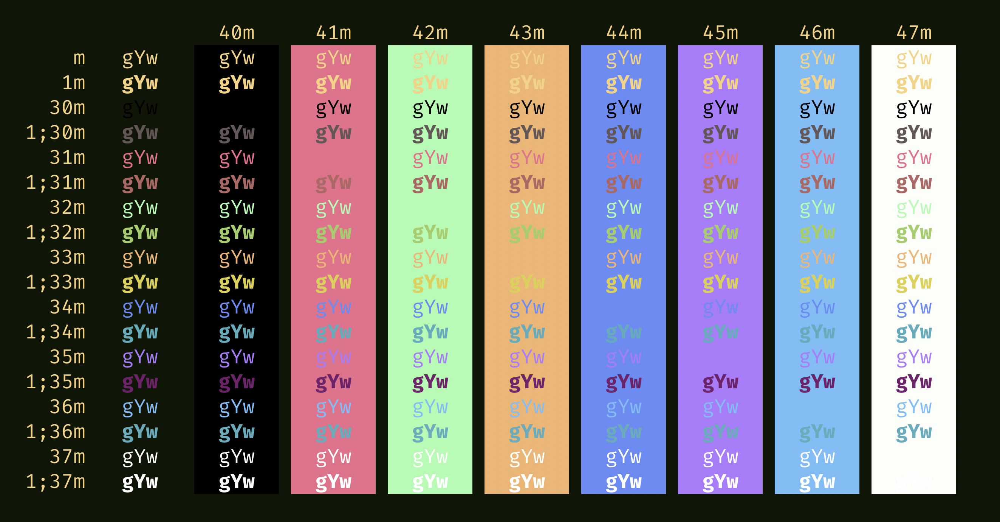

Gilded Forest is a terminal color scheme for programming and note-taking.

## Dark

| Palette      | Hex       | Hex-Bright | RGB                | Bright-RGB         | HSL                | Bright-HSL         |
| ------------ | --------- | ---------- | ------------------ | ------------------ | ------------------ | ------------------ |
| Background   | `#0e1406` | `#0e1406`  | rgb(14, 20, 6)     | rgb(14, 20, 6)     | hsl(86, 54%, 5%)   | hsl(86, 54%, 5%)   |
| Current Line | `#44475a` | `#44475a`  | rgb(68, 71, 90)    | rgb(68, 71, 90)    | hsl(232, 14%, 31%) | hsl(232, 14%, 31%) |
| Selection    | `#28296e` | `#28296e`  | rgb(40, 41, 110)   | rgb(40, 41, 110)   | hsl(239, 47%, 29%) | hsl(239, 47%, 29%) |
| Foreground   | `#f0d388` | `#f0d388`  | rgb(240, 211, 136) | rgb(240, 211, 136) | hsl(43, 78%, 74%)  | hsl(43, 78%, 74%)  |
| Black        | `#000000` | `#625656`  | rgb(0, 0, 0)       | rgb(98, 86, 86)    | hsl(0, 0%, 0%)     | hsl(0, 7%, 36%)    |
| Red          | `#dc738b` | `#a86864`  | rgb(220, 115, 139) | rgb(168, 104, 100) | hsl(346, 60%, 66%) | hsl(4, 28%, 53%)   |
| Green        | `#b8f9b5` | `#a7cc6f`  | rgb(184, 249, 181) | rgb(167, 204, 111) | hsl(117, 85%, 84%) | hsl(84, 48%, 62%)  |
| Yellow       | `#e9b677` | `#dad05d`  | rgb(233, 182, 119) | rgb(218, 208, 93)  | hsl(33, 72%, 69%)  | hsl(55, 63%, 61%)  |
| Blue         | `#6d8aef` | `#67aaba`  | rgb(109, 138, 239) | rgb(103, 170, 186) | hsl(227, 80%, 68%) | hsl(192, 38%, 57%) |
| Magenta      | `#a67df7` | `#6b2368`  | rgb(166, 125, 247) | rgb(107, 35, 104)  | hsl(260, 88%, 73%) | hsl(302, 51%, 28%) |
| Cyan         | `#83bcf3` | `#6baaba`  | rgb(131, 188, 243) | rgb(107, 170, 186) | hsl(209, 82%, 73%) | hsl(192, 36%, 57%) |
| White        | `#fcfdf9` | `#fefefe`  | rgb(252, 253, 249) | rgb(254, 254, 254) | hsl(75, 50%, 98%)  | hsl(0, 0%, 100%)   |

